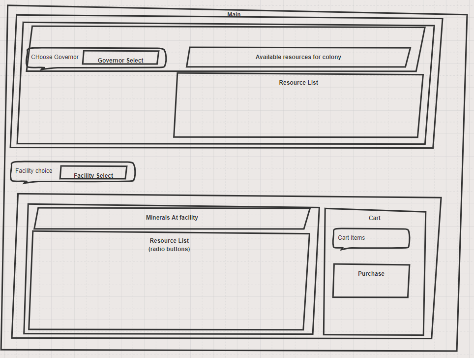
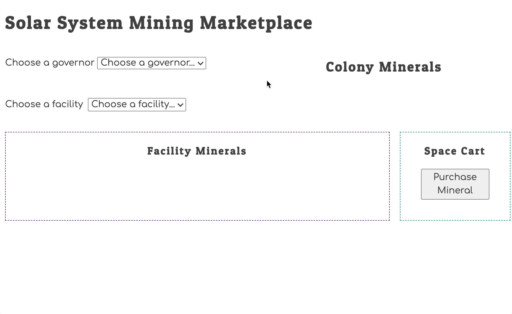

# Exomine

This application is a NSS group project, worked on by Sean Derevjanik, Melissa Fox, and Ross Stovenour.

## Learning Objectives

Completing the project was not the objective. The focus was building the following skills and deepening knowledge of the concepts.

1. Collaboration (are you helping your team succeed)
1. Productivity (are you wasting too much time before asking for help)
1. Data types
1. Data structures
1. Navigating data relationships using primary keys and foreign keys

Quote from previous student...

> "This project has made me realize the importance of an ERD and quality design of your data structure and how to access that data."

## Wireframe

This is the layout for the application that was designed by the group at the start of the project.

## ERD

This is the ERD that was constructed during the planning stages to establish our database structure and the relationships needed for application functionality.

## Workflow Animation

This animation shows the basic behavior of the application.

## Application Function

The application that was developed immitates an e-commerce application, which uses modularized JavaScript, with eventListeners and state changes to allow the user to Select an active Governor, then Select one or more Facilities to purchase minerals from. As soon as a Governor is selected, the available resources from their Colony(Planet) are displayed. The user may then select a facility, which will generate a list of minerals available for purchase from that location. The user may then select a mineral option and add it to their cart using the "Add to Cart" button. The user may add multiple mineral selections from multiple facilities before completing their purchase. Once satisfied with their mineral selections, the user may then purchase all items in their cart using the "Purchase All Minerals" button. Once clicked, the purchased mineral quanitities from the origin facility and the governor's associated colony will be updated in the browser.
